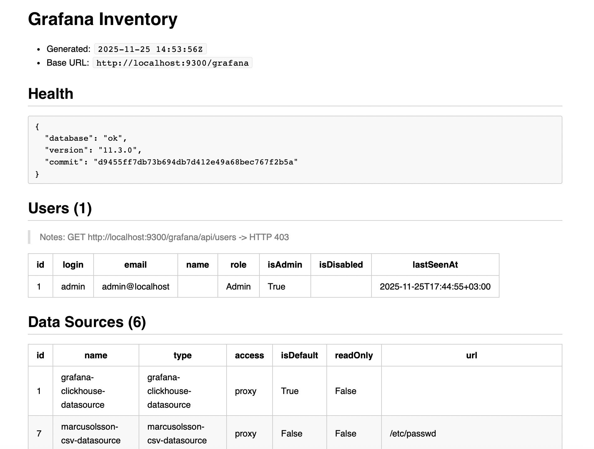

# I JUST WANTED TO… GRAFUNA RED TEAM

Observability is about visibility.  
So is compromise.

This repo contains the public bits of my recent talk: slides + small helper scripts.  
Everything here is **read-only / educational** unless you decide to be creative (don’t).

## Artifacts

- Slides (PDF): **Gordey - Grafana - ZN2025.pdf** 
- Script: **grafana_inventory.py** 

## What the talk is about

Cloud-native observability stack (Prometheus / Grafana / friends) is:
- everywhere,
- powerful,
- and often shipped with “it’s fine” defaults.

The paradox: we built monitoring to **reduce** incidents, and accidentally created a new attack surface to **route** them.

Covered topics (high level):
- `/metrics`, `/debug`, `/pprof`, “helpful” APIs, and why they are *helpful* to the wrong people.
- Grafana as a **control plane** (dashboards, plugins, datasources, users/roles).
- Misconfigs at scale, and why “internal service” is a fantasy with good marketing.
- Red team checklist + blue team mitigations (aka “bind to localhost and pray”).

## grafana_inventory.py

A minimal inventory collector for Grafana:
- pulls metadata (health, users, datasources, plugins, dashboards/folders)
- outputs a Markdown report
- **does not write** to Grafana (GET-only)
- redacts `user:pass@host` in URLs

### Requirements

- Python 3.8+
- `requests`

```bash
pip install requests
```

### Usage

```bash
python3 grafana_inventory.py \
  --base-url "https://grafana.example.com" \
  --output grafana_inventory.md \
  --api-key "<TOKEN>"
```

You can also provide the token via env:

```bash
export GRAFANA_API_KEY="<TOKEN>"
python3 grafana_inventory.py --base-url "https://grafana.example.com"
```

Notes:

* Works with subpaths (`https://host/grafana`).
* Running without a token is allowed (and sometimes informative): you’ll simply inventory what anonymous users can see.
* Output is intentionally boring. Boring is good. Boring is secure. (Usually.)
* 



## Safety / Legal

* Use only on systems you own or have explicit permission to test.
* If you point this at random internet endpoints: congratulations, you became the incident/problem/criminal case.

## Credits

Sergey Gordeychik.

If you found this useful, patch your observability stack. If you found it scary, patch it twice.

## License

Code: MIT 

Slides: CC BY 4.0 

Or pick something else.

